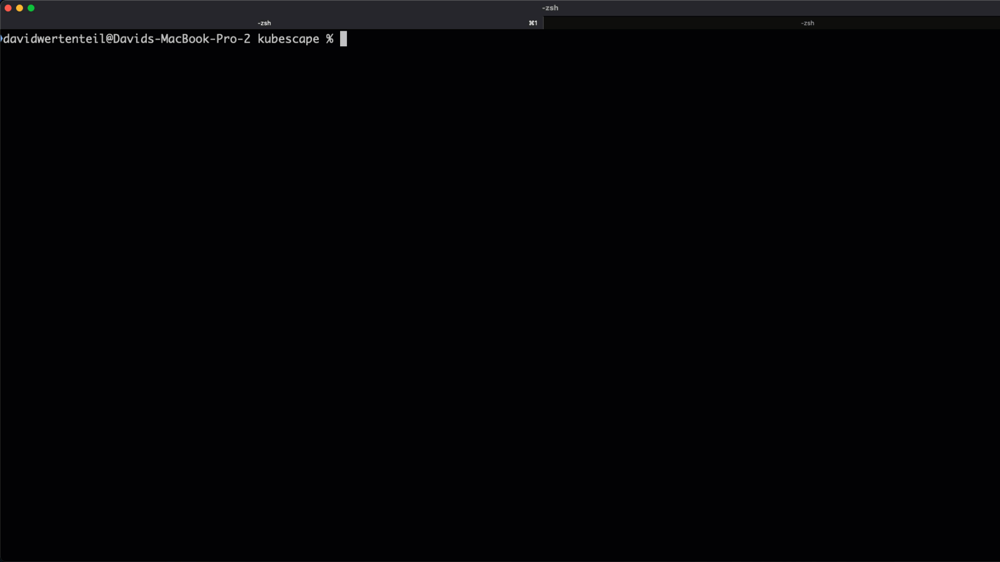

[](https://github.com/kubescape/kubescape/releases)
[](https://github.com/kubescape/kubescape/actions/workflows/02-release.yaml)
[](https://goreportcard.com/report/github.com/kubescape/kubescape)
[](https://gitpod.io/#https://github.com/kubescape/kubescape)
[](https://github.com/kubescape/kubescape/blob/master/LICENSE)
[](https://landscape.cncf.io/card-mode?project=sandbox&selected=kubescape)
[](https://artifacthub.io/packages/search?repo=kubescape)
[](https://app.fossa.com/projects/git%2Bgithub.com%2Fkubescape%2Fkubescape?ref=badge_shield&issueType=license)
[](https://www.bestpractices.dev/projects/6944)
[](https://securityscorecards.dev/viewer/?uri=github.com/kubescape/kubescape)
[](https://github.com/kubescape/kubescape/stargazers)
[](https://twitter.com/kubescape)
[](https://cloud-native.slack.com/archives/C04EY3ZF9GE)

# Kubescape

<picture>
  <source media="(prefers-color-scheme: dark)" srcset="https://raw.githubusercontent.com/cncf/artwork/master/projects/kubescape/stacked/white/kubescape-stacked-white.svg" width="150">
  <source media="(prefers-color-scheme: light)" srcset="https://raw.githubusercontent.com/cncf/artwork/master/projects/kubescape/stacked/color/kubescape-stacked-color.svg" width="150">
  
</picture>

_An open-source Kubernetes security platform for your clusters, CI/CD pipelines, and IDE that seperates out the security signal from the scanner noise_

Kubescape is an open-source Kubernetes security platform, built for use in your day-to-day workflow, by fitting into your clusters, CI/CD pipelines and IDE. It serves as a one-stop-shop for Kuberenetes security and includes vulnerability and misconfiguration scanning. You can run scans via the CLI, or add the Kubescape Helm chart, which gives an in-depth view of what is going on in the cluster.

Kubescape includes misconfiguration and vulnerability scanning as well as risk analysis and security compliance indicators. All results are presented in context and users get many cues on what to do based on scan results.Targeted at the DevSecOps practitioner or platform engineer, it offers an easy-to-use CLI interface, flexible output formats, and automated scanning capabilities. It saves Kubernetes users and admins precious time, effort, and resources.

Kubescape scans clusters, YAML files, and Helm charts. It detects misconfigurations according to multiple frameworks (including [NSA-CISA](https://www.armosec.io/blog/kubernetes-hardening-guidance-summary-by-armo/?utm_source=github&utm_medium=repository), [MITRE ATT&CK®](https://www.microsoft.com/security/blog/2021/03/23/secure-containerized-environments-with-updated-threat-matrix-for-kubernetes/) and the [CIS Benchmark](https://www.armosec.io/blog/cis-kubernetes-benchmark-framework-scanning-tools-comparison/?utm_source=github&utm_medium=repository)).

Kubescape was created by [ARMO](https://www.armosec.io/?utm_source=github&utm_medium=repository) and is a [Cloud Native Computing Foundation (CNCF) sandbox project](https://www.cncf.io/sandbox-projects/).

## Demo


_Please [star ⭐](https://github.com/kubescape/kubescape/stargazers) the repo if you want us to continue developing and improving Kubescape! 😀_

## Getting started

Experimenting with Kubescape is as easy as:

```sh
curl -s https://raw.githubusercontent.com/kubescape/kubescape/master/install.sh | /bin/bash
```

Learn more about:

* [Installing Kubescape](docs/installation.md)
* [Running your first scan](docs/getting-started.md#run-your-first-scan)
* [Usage](docs/getting-started.md#examples)
* [Architecture](docs/architecture.md)
* [Building Kubescape from source](https://github.com/kubescape/kubescape/wiki/Building)

_Did you know you can use Kubescape in all these places?_

<div align="center">
    
</div>

## Kubescape-operator Helm-Chart

Besides the CLI, the Kubescape operator can also be installed via a Helm chart. Installing the Helm chart is an excellent way to begin using Kubescape, as it provides extensive features such as continuous scanning, image vulnerability scanning, runtime analysis, network policy generation, and more. You can find the Helm chart in the [Kubescape-operator documentation](https://kubescape.io/docs/install-operator/).

## Kubescape GitHub Action

Kubescape can be used as a GitHub Action. This is a great way to integrate Kubescape into your CI/CD pipeline. You can find the Kubescape GitHub Action in the [GitHub Action marketplace](https://github.com/marketplace/actions/kubescape).

## Under the hood

Kubescape uses [Open Policy Agent](https://github.com/open-policy-agent/opa) to verify Kubernetes objects against [a library of posture controls](https://github.com/kubescape/regolibrary).

By default, the results are printed in a console-friendly manner, but they can be:

* exported to JSON or junit XML
* rendered to HTML or PDF
* submitted to a [cloud service](docs/providers.md)

It retrieves Kubernetes objects from the API server and runs a set of [Rego snippets](https://www.openpolicyagent.org/docs/latest/policy-language/) developed by [ARMO](https://www.armosec.io?utm_source=github&utm_medium=repository).

## Community

Kubescape is an open source project, we welcome your feedback and ideas for improvement. We are part of the Kubernetes community and are building more tests and controls as the ecosystem develops.

We hold [community meetings](https://zoom.us/j/95174063585) on Zoom, on the first Tuesday of every month, at 14:00 GMT. ([See that in your local time zone](https://time.is/compare/1400_in_GMT)).

The Kubescape project follows the [CNCF Code of Conduct](https://github.com/cncf/foundation/blob/master/code-of-conduct.md).

### Adopters

See [here](ADOPTERS.md) a list of adopters.

## Contributions

Thanks to all our contributors!  Check out our [CONTRIBUTING](CONTRIBUTING.md) file to learn how to join them.

* Feel free to pick a task from the [issues](https://github.com/kubescape/kubescape/issues?q=is%3Aissue+is%3Aopen+label%3A%22open+for+contribution%22), [roadmap](docs/roadmap.md) or suggest a feature of your own.
* [Open an issue](https://github.com/kubescape/kubescape/issues/new/choose): we aim to respond to all issues within 48 hours.
* [Join the CNCF Slack](https://slack.cncf.io/) and then our [users](https://cloud-native.slack.com/archives/C04EY3ZF9GE) or [developers](https://cloud-native.slack.com/archives/C04GY6H082K) channel.

<br>

<a href = "https://github.com/kubescape/kubescape/graphs/contributors">
  
</a>

## Changelog

Kubescape changes are tracked on the [release](https://github.com/kubescape/kubescape/releases) page

## License

Copyright 2021-2023, the Kubescape Authors. All rights reserved. Kubescape is released under the Apache 2.0 license. See the [LICENSE](LICENSE) file for details.

Kubescape is a [Cloud Native Computing Foundation (CNCF) sandbox project](https://www.cncf.io/sandbox-projects/) and was contributed by [ARMO](https://www.armosec.io/?utm_source=github&utm_medium=repository).

<div align="center">
    
</div>
