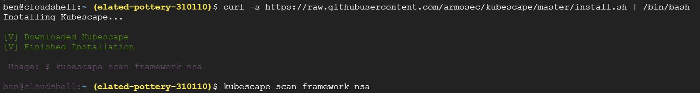

[](https://github.com/armosec/kubescape/actions/workflows/build.yaml)
[]()
[](https://goreportcard.com/report/github.com/armosec/kubescape)

Kubescape is the first tool for testing if Kubernetes is deployed securely as defined in [Kubernetes Hardening Guidance by NSA and CISA](https://www.nsa.gov/News-Features/Feature-Stories/Article-View/Article/2716980/nsa-cisa-release-kubernetes-hardening-guidance/)

Use Kubescape to test clusters or scan single YAML files and integrate it to your processes. 


# TL;DR
## Installation
To install the tool locally, run this:

```
curl -s https://raw.githubusercontent.com/armosec/kubescape/master/install.sh | /bin/bash
```



## Run

### Cluster testing
To get a fast check of the security posture of your Kubernetes cluster, run this:

```
kubescape scan framework nsa --exclude-namespaces kube-system,kube-public
```

If you wish to scan all namespaces in your cluster, remove the `--exclude-namespaces` flag.

### Pre-deployment testing
Check your YAML files before you're deploying, simply add them at the end of command line:

```
kubescape scan framework nsa *.yaml
```

### Integration with other tools

Kubescape can produce output fitting for later processing:
* JSON (`-o json`)
* JUnit XML (`-o junit`)

Example:
```
kubescape scan framework nsa --silent -o -junit > results.xml
```


# How to build 

Note: development (and the release process) is done with Go 1.16 

1. Clone Project
```
git clone git@github.com:armosec/kubescape.git kubescape && cd "$_"
```

2. Build
```
go mod tidy && go build -o kubescape .
```

3. Run
```
./kubescape scan framework nsa --exclude-namespaces kube-system,kube-public
```

4. Enjoy :zany_face:

# Under the hood

## Tests
Kubescape is running the following tests according to what is defined by [Kubernetes Hardening Guidance by NSA and CISA](https://www.nsa.gov/News-Features/Feature-Stories/Article-View/Article/2716980/nsa-cisa-release-kubernetes-hardening-guidance/)
* Non-root containers
* Immutable container filesystem 
* Privileged containers 
* hostPID, hostIPC privileges
* hostNetwork access
* allowedHostPaths field
* Protecting pod service account tokens
* Resource policies
* Control plane hardening 
* Exposed dashboard
* Allow privilege escalation
* Applications credentials in configuration files
* Cluster-admin binding
* Exec into container
* Dangerous capabilities
* Insecure capabilities
* Linux hardening


## Technology
Kubescape based on OPA engine: https://github.com/open-policy-agent/opa and ARMO's posture controls. 

The tools retrieves Kubernetes objects from the API server and runs a set of [regos snippets](https://www.openpolicyagent.org/docs/latest/policy-language/) developed by [ARMO](https://www.armosec.io/). 

The results by default printed in a pretty "console friendly" manner, but they can be retrieved in JSON format for further processing.

Kubescape is an open source project, we welcome your feedback and ideas for improvement. We’re also aiming to collaborate with the Kubernetes community to help make the tests themselves more robust and complete as Kubernetes develops.


