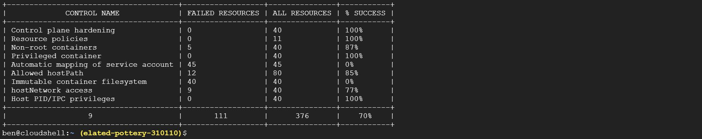

kubescape is a tool for testing Kubernetes clusters against industry accepted security standards and recomendations like:
* NSA hardening for Kubernetes operators [see here](https://media.defense.gov/2021/Aug/03/2002820425/-1/-1/1/CTR_KUBERNETES%20HARDENING%20GUIDANCE.PDF)
* MITRE threat matrix for Kubernetes [see here](https://www.microsoft.com/security/blog/2020/04/02/attack-matrix-kubernetes/)

# TL;DR
## Installation
To install the tool locally, run this:

`curl -s https://raw.githubusercontent.com/armosec/kubescape/master/install.sh | /bin/bash`

## Run
To get a fast check of the security posture of your Kubernetes cluster, run this:

`kubescape scan framework nsa`

# Status

# How to build 
`go mod tidy && go build -o kubescape` :zany_face:

# Under the hood

## Tests
Defining the tests here...

## Technology
Kubescape based on OPA engine: https://github.com/open-policy-agent/opa and ARMO's posture controls. 

The tools retrieves Kubernetes objects from the API server and runs a set of [regos snippets](https://www.openpolicyagent.org/docs/latest/policy-language/) developed by (ARMO)[https://www.armosec.io/]. 

The results by default printed in a pretty "console friendly" manner, but they can be retrieved in JSON format for further processing.
