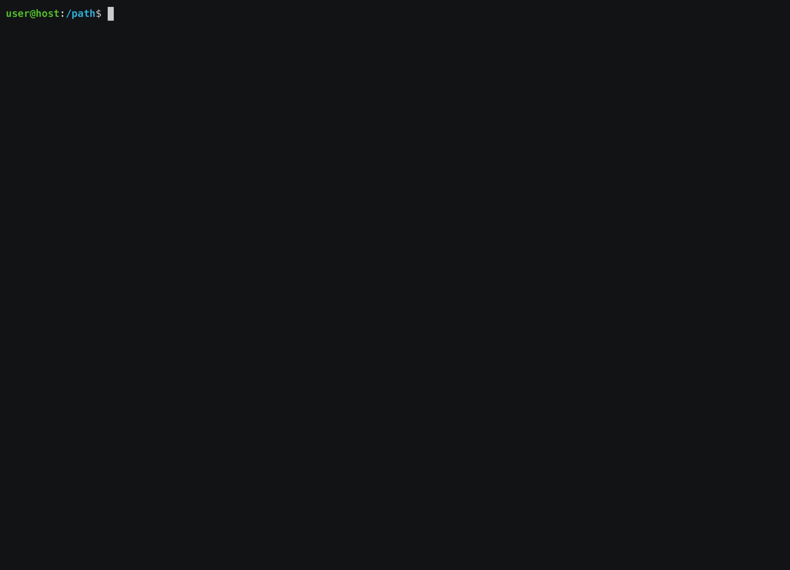

[](https://github.com/kubescape/kubescape/releases)
[](https://github.com/kubescape/kubescape/actions/workflows/02-release.yaml)
[](https://goreportcard.com/report/github.com/kubescape/kubescape)
[](https://gitpod.io/#https://github.com/kubescape/kubescape)
[](https://github.com/kubescape/kubescape/blob/master/LICENSE)
[](https://landscape.cncf.io/card-mode?project=sandbox&selected=kubescape)
[](https://twitter.com/kubescape)

# Kubescape

<picture>
  <source media="(prefers-color-scheme: dark)" srcset="https://raw.githubusercontent.com/cncf/artwork/master/projects/kubescape/stacked/white/kubescape-stacked-white.svg" width="150">
  <source media="(prefers-color-scheme: light)" srcset="https://raw.githubusercontent.com/cncf/artwork/master/projects/kubescape/stacked/color/kubescape-stacked-color.svg" width="150">
  
</picture>

_An open-source Kubernetes security platform for your IDE, CI/CD pipelines, and clusters_

Kubescape is an open-source Kubernetes security platform. It includes risk analysis, security compliance, and misconfiguration scanning. Targeted at the DevSecOps practitioner or platform engineer, it offers an easy-to-use CLI interface, flexible output formats, and automated scanning capabilities. It saves Kubernetes users and admins precious time, effort, and resources.

Kubescape scans clusters, YAML files, and Helm charts. It detects misconfigurations according to multiple frameworks (including [NSA-CISA](https://www.armosec.io/blog/kubernetes-hardening-guidance-summary-by-armo/?utm_source=github&utm_medium=repository), [MITRE ATT&CK®](https://www.microsoft.com/security/blog/2021/03/23/secure-containerized-environments-with-updated-threat-matrix-for-kubernetes/) and the [CIS Benchmark](https://www.armosec.io/blog/cis-kubernetes-benchmark-framework-scanning-tools-comparison/?utm_source=github&utm_medium=repository)).

Kubescape was created by [ARMO](https://www.armosec.io/?utm_source=github&utm_medium=repository) and is a [Cloud Native Computing Foundation (CNCF) sandbox project](https://www.cncf.io/sandbox-projects/).

## Demo


_Please [star ⭐](https://github.com/kubescape/kubescape/stargazers) the repo if you want us to continue developing and improving Kubescape! 😀_

## Getting started

Experimenting with Kubescape is as easy as:

```sh
curl -s https://raw.githubusercontent.com/kubescape/kubescape/master/install.sh | /bin/bash
```

Learn more about:

* [Installing Kubescape](docs/getting-started.md#install-kubescape)
* [Running your first scan](docs/getting-started.md#run-your-first-scan)
* [Usage](docs/getting-started.md#examples)
* [Architecture](docs/architecture.md)
* [Building Kubescape from source](docs/building.md)

_Did you know you can use Kubescape in all these places?_

<div align="center">
    
</div>

## Under the hood

Kubescape uses [Open Policy Agent](https://github.com/open-policy-agent/opa) to verify Kubernetes objects against [a library of posture controls](https://github.com/kubescape/regolibrary).

By default, the results are printed in a console-friendly manner, but they can be:

* exported to JSON or junit XML
* rendered to HTML or PDF
* submitted to a [cloud service](docs/providers.md)

It retrieves Kubernetes objects from the API server and runs a set of [Rego snippets](https://www.openpolicyagent.org/docs/latest/policy-language/) developed by [ARMO](https://www.armosec.io?utm_source=github&utm_medium=repository).

## Community

Kubescape is an open source project, we welcome your feedback and ideas for improvement. We are part of the Kubernetes community and are building more tests and controls as the ecosystem develops.

We hold [community meetings](https://us02web.zoom.us/j/84020231442) on Zoom, on the first Tuesday of every month, at 14:00 GMT.

The Kubescape project follows the [CNCF Code of Conduct](https://github.com/cncf/foundation/blob/master/code-of-conduct.md).

## Contributions 

Thanks to all our contributors!  Check out our [CONTRIBUTING](CONTRIBUTING.md) file to learn how to join them.

* Feel free to pick a task from the [issues](https://github.com/kubescape/kubescape/issues?q=is%3Aissue+is%3Aopen+label%3A%22open+for+contribution%22), [roadmap](docs/roadmap.md) or suggest a feature of your own.
* [Open an issue](https://github.com/kubescape/kubescape/issues/new/choose): we aim to respond to all issues within 48 hours.
* [Join the CNCF Slack](https://slack.cncf.io/) and then our [users](https://cloud-native.slack.com/archives/C04EY3ZF9GE) or [developers](https://cloud-native.slack.com/archives/C04GY6H082K) channel.

<br>

<a href = "https://github.com/kubescape/kubescape/graphs/contributors">
  
</a>

## License

Copyright 2021-2023, the Kubescape Authors. All rights reserved. Kubescape is released under the Apache 2.0 license. See the [LICENSE](LICENSE) file for details.

Kubescape is a [Cloud Native Computing Foundation (CNCF) sandbox project](https://www.cncf.io/sandbox-projects/) and was contributed by [ARMO](https://www.armosec.io/?utm_source=github&utm_medium=repository).

<div align="center">
    
</div>
