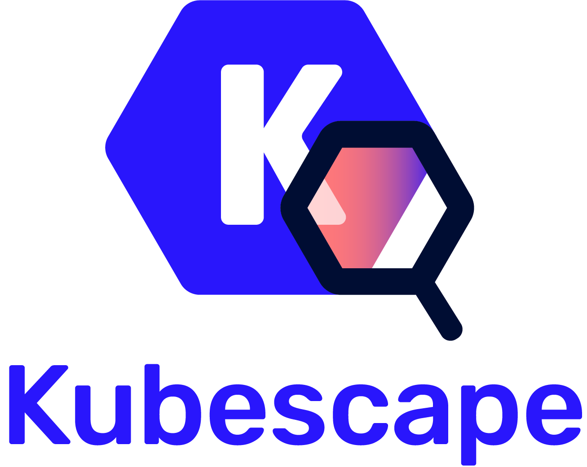
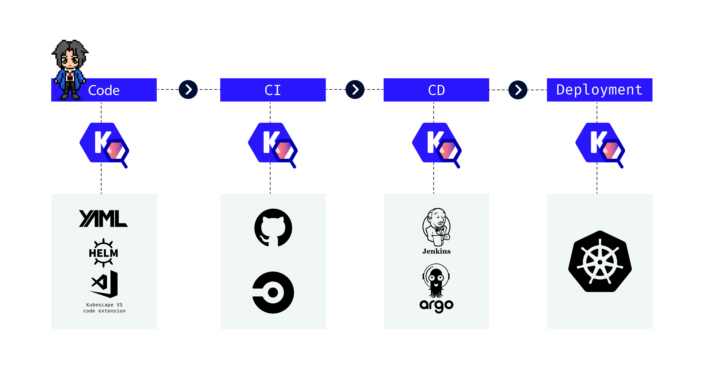
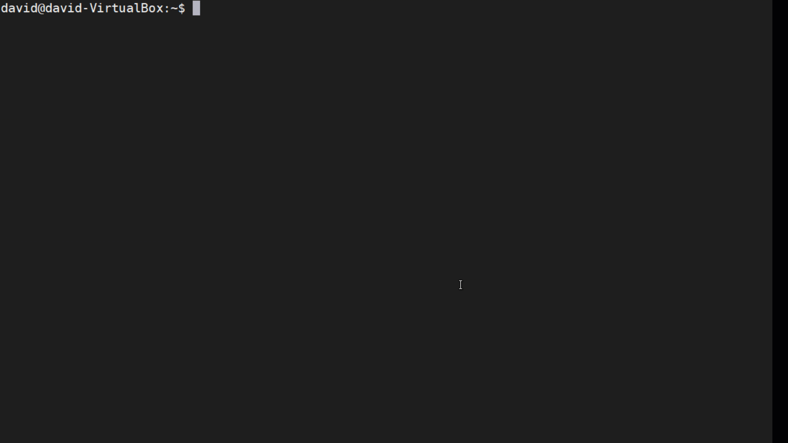
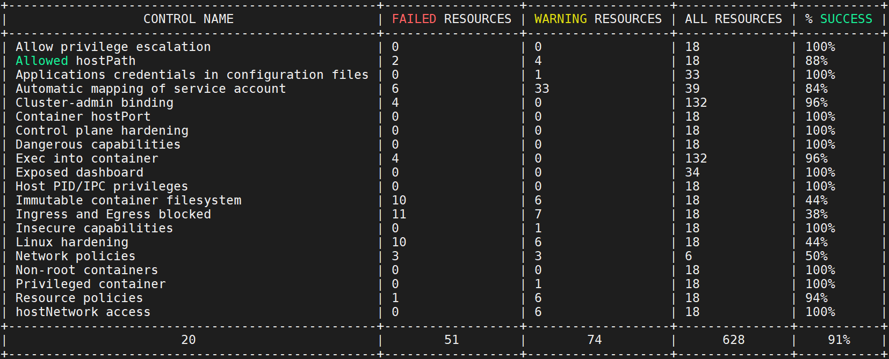

[](https://github.com/armosec/kubescape/actions/workflows/build.yaml)
[](https://goreportcard.com/report/github.com/armosec/kubescape)


Kubescape is a K8s open-source tool providing a multi-cloud K8s single pane of glass, including risk analysis, security compliance, RBAC visualizer and image vulnerabilities scanning. 
Kubescape scans K8s clusters, YAML files, and HELM charts, detecting misconfigurations according to multiple frameworks (such as the [NSA-CISA](https://www.armosec.io/blog/kubernetes-hardening-guidance-summary-by-armo) , [MITRE ATT&CK®](https://www.microsoft.com/security/blog/2021/03/23/secure-containerized-environments-with-updated-threat-matrix-for-kubernetes/)), software vulnerabilities, and RBAC (role-based-access-control) violations at early stages of the CI/CD pipeline, calculates risk score instantly and shows risk trends over time.
It became one of the fastest-growing Kubernetes tools among developers due to its easy-to-use CLI interface, flexible output formats, and automated scanning capabilities, saving Kubernetes users and admins’ precious time, effort, and resources.
Kubescape integrates natively with other DevOps tools, including Jenkins, CircleCI, Github workflows, Prometheus, and Slack, and supports multi-cloud K8s deployments like EKS, GKE, and AKS.

</br>

<!-- # Kubescape Coverage


</br> -->


# Kubescape CLI:


</br>

<!-- # Kubescape overview:
 -->

# TL;DR
## Install:
```sh
curl -s https://raw.githubusercontent.com/armosec/kubescape/master/install.sh | /bin/bash
```

[Install on windows](#install-on-windows)

[Install on macOS](#install-on-macos)

[Install on NixOS or Linux/macOS via nix](#install-on-nixos-or-with-nix-community)

[Install using Go](#install-using-go)

## Run:
```sh
kubescape scan --submit --enable-host-scan --verbose
```



</br>

> Kubescape is an open source project, we welcome your feedback and ideas for improvement. We’re also aiming to collaborate with the Kubernetes community to help make the tests themselves more robust and complete as Kubernetes develops.

</br>

### Click [👍](https://github.com/armosec/kubescape/stargazers) if you want us to continue to develop and improve Kubescape 😀

</br>


# Being part of the team

We invite you to our team! We are excited about this project and want to return the love we get.

Want to contribute? Want to discuss something? Have an issue?

* Feel free to pick a task from the [roadmap](docs/roadmap.md) or suggest a feature of your own. [Contact us](MAINTAINERS.md) directly for more information :) 
* Open a issue, we are trying to respond within 48 hours
* [Join us](https://armosec.github.io/kubescape/) in a discussion on our discord server!

[](https://armosec.github.io/kubescape/)


# Options and examples

[Kubescape docs](https://hub.armosec.io/docs)

## Playground
* [Kubescape playground](https://www.katacoda.com/pathaksaiyam/scenarios/kubescape)

## Tutorials

* [Overview](https://youtu.be/wdBkt_0Qhbg)
* [How To Secure Kubernetes Clusters With Kubescape And Armo](https://youtu.be/ZATGiDIDBQk)
* [Scan Kubernetes YAML files](https://youtu.be/Ox6DaR7_4ZI)
* [Scan Kubescape on an air-gapped environment (offline support)](https://youtu.be/IGXL9s37smM)
* [Managing exceptions in the Kubescape SaaS version](https://youtu.be/OzpvxGmCR80)
* [Configure and run customized frameworks](https://youtu.be/12Sanq_rEhs)
* Customize controls configurations. [Kubescape CLI](https://youtu.be/955psg6TVu4), [Kubescape SaaS](https://youtu.be/lIMVSVhH33o)

## Install on Windows

**Requires powershell v5.0+**

``` powershell
iwr -useb https://raw.githubusercontent.com/armosec/kubescape/master/install.ps1 | iex
```

Note: if you get an error you might need to change the execution policy (i.e. enable Powershell) with

``` powershell
Set-ExecutionPolicy RemoteSigned -scope CurrentUser
```

## Install on macOS

1. ```sh
    brew tap armosec/kubescape
    ```
2. ```sh
    brew install kubescape
    ```

## Install on NixOS or with nix (Community)

Direct issues installing `kubescape` via `nix` through the channels mentioned [here](https://nixos.wiki/wiki/Support)

You can use `nix` on Linux or macOS and on other platforms unofficially.

Try it out in an ephemeral shell: `nix-shell -p kubescape`

Install declarative as usual

NixOS:

```nix
  # your other config ...
  environment.systemPackages = with pkgs; [
    # your other packages ...
    kubescape
  ];
```

home-manager:

```nix
  # your other config ...
  home.packages = with pkgs; [
    # your other packages ...
    kubescape
  ];
```

Or to your profile (not preferred): `nix-env --install -A nixpkgs.kubescape`


## Usage & Examples

### Examples


#### Scan a running Kubernetes cluster and submit results to the [Kubescape SaaS version](https://portal.armo.cloud/)
```
kubescape scan --submit --enable-host-scan  --verbose
```

> Read [here](https://hub.armosec.io/docs/host-sensor) more about the `enable-host-scan` flag

#### Scan a running Kubernetes cluster with [`nsa`](https://www.nsa.gov/Press-Room/News-Highlights/Article/Article/2716980/nsa-cisa-release-kubernetes-hardening-guidance/) framework and submit results to the [Kubescape SaaS version](https://portal.armo.cloud/)
```
kubescape scan framework nsa --submit
```


#### Scan a running Kubernetes cluster with [`MITRE ATT&CK®`](https://www.microsoft.com/security/blog/2021/03/23/secure-containerized-environments-with-updated-threat-matrix-for-kubernetes/) framework and submit results to the [Kubescape SaaS version](https://portal.armo.cloud/)
```
kubescape scan framework mitre --submit
```


#### Scan a running Kubernetes cluster with a specific control using the control name or control ID. [List of controls](https://hub.armosec.io/docs/controls) 
```
kubescape scan control "Privileged container"
```

#### Scan specific namespaces
```
kubescape scan --include-namespaces development,staging,production
```

#### Scan cluster and exclude some namespaces
```
kubescape scan --exclude-namespaces kube-system,kube-public
```

#### Scan local `yaml`/`json` files before deploying. [Take a look at the demonstration](https://youtu.be/Ox6DaR7_4ZI) Submit the results in case the directory is a git repo. [docs](https://hub.armosec.io/docs/repository-scanning)
```
kubescape scan *.yaml --submit
```

#### Scan kubernetes manifest files from a git repository [and submit the results](https://hub.armosec.io/docs/repository-scanning)
```
kubescape scan https://github.com/armosec/kubescape --submit
```

#### Display all scanned resources (including the resources who passed) 
```
kubescape scan --verbose
```

#### Output in `json` format

> Add the `--format-version v2` flag 

```
kubescape scan --format json --format-version v2 --output results.json
```

#### Output in `junit xml` format
```
kubescape scan --format junit --output results.xml
```

#### Output in `pdf` format - Contributed by [@alegrey91](https://github.com/alegrey91)

```
kubescape scan --format pdf --output results.pdf
```

#### Output in `prometheus` metrics format - Contributed by [@Joibel](https://github.com/Joibel)

```
kubescape scan --format prometheus
```

#### Scan with exceptions, objects with exceptions will be presented as `exclude` and not `fail`
[Full documentation](examples/exceptions/README.md)
```
kubescape scan --exceptions examples/exceptions/exclude-kube-namespaces.json
```

#### Scan Helm charts 
```
kubescape scan </path/to/directory> --submit
```
> Kubescape will load the default values file

### Offline/Air-gaped Environment Support

[Video tutorial](https://youtu.be/IGXL9s37smM)

It is possible to run Kubescape offline!
#### Download all artifacts

1. Download and save in local directory, if path not specified, will save all in `~/.kubescape`
```
kubescape download artifacts --output path/to/local/dir
```
2. Copy the downloaded artifacts to the air-gaped/offline environment

3. Scan using the downloaded artifacts
```
kubescape scan --use-artifacts-from path/to/local/dir
```

#### Download a single artifacts

You can also download a single artifacts and scan with the `--use-from` flag

1. Download and save in file, if file name not specified, will save in `~/.kubescape/<framework name>.json`
```
kubescape download framework nsa --output /path/nsa.json
```
2. Copy the downloaded artifacts to the air-gaped/offline environment

3. Scan using the downloaded framework
```
kubescape scan framework nsa --use-from /path/nsa.json
```


## Scan Periodically using Helm - Contributed by [@yonahd](https://github.com/yonahd)  
[Please follow the instructions here](https://hub.armosec.io/docs/installation-of-armo-in-cluster)
[helm chart repo](https://github.com/armosec/armo-helm)

## Scan using docker image

Official Docker image `quay.io/armosec/kubescape`

```
docker run -v "$(pwd)/example.yaml:/app/example.yaml  quay.io/armosec/kubescape scan /app/example.yaml
```

If you wish, you can [build the docker image on your own](build/README.md)

# Submit data manually

Use the `submit` command if you wish to submit data manually

## Submit scan results manually

> Support forward compatibility by using the `--format-version v2` flag

First, scan your cluster using the `json` format flag: `kubescape scan framework <name> --format json --format-version v2 --output path/to/results.json`.

Now you can submit the results to the Kubescape SaaS version -
```
kubescape submit results path/to/results.json
```

# Integrations

## VS Code Extension 

 

Scan the YAML files while writing them using the [vs code extension](https://github.com/armosec/vscode-kubescape/blob/master/README.md) 

## Lens Extension

View Kubescape scan results directly in [Lens IDE](https://k8slens.dev/) using kubescape [Lens extension](https://github.com/armosec/lens-kubescape/blob/master/README.md)


# Building Kubescape

## Windows

Simply run `go build .` OR `make build`

## Linux / MacOS

1. Install libgit2 dependency (first time): `make libgit2`
2. Build: `make build`
3. Test: `make test`

## VS code configuration samples

You can use the samples files below to setup your VS code environment for building and debugging purposes.


```json5
// .vscode/settings.json
{
    "go.testTags": "static",
    "go.buildTags": "static",
    "go.toolsEnvVars": {
        "CGO_ENABLED": "1"
    }
}
```

```json5
// .vscode/launch.json∂
{
    "version": "0.2.0",
    "configurations": [
        {
            "name": "Launch Package",
            "type": "go",
            "request": "launch",
            "mode": "auto",
            "program": "${workspaceFolder}/main.go",
            "args": [
                "scan",
                "--logger",
                "debug"
            ],
            "buildFlags": "-tags=static"
        }
    ]
}
```

# Under the hood

## Technology
Kubescape based on OPA engine: https://github.com/open-policy-agent/opa and ARMO's posture controls.

The tools retrieves Kubernetes objects from the API server and runs a set of [rego's snippets](https://www.openpolicyagent.org/docs/latest/policy-language/) developed by [ARMO](https://www.armosec.io/).

The results by default printed in a pretty "console friendly" manner, but they can be retrieved in JSON format for further processing.

Kubescape is an open source project, we welcome your feedback and ideas for improvement. We’re also aiming to collaborate with the Kubernetes community to help make the tests themselves more robust and complete as Kubernetes develops.

## Thanks to all the contributors ❤️
<a href = "https://github.com/armosec/kubescape/graphs/contributors">
  
</a>

