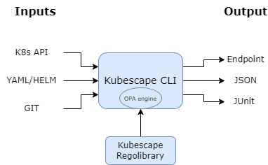

[](https://github.com/kubescape/kubescape/releases)
[](https://github.com/kubescape/kubescape/actions/workflows/02-release.yaml)
[](https://goreportcard.com/report/github.com/kubescape/kubescape)
[](https://gitpod.io/#https://github.com/kubescape/kubescape)
[](https://github.com/kubescape/kubescape/blob/master/LICENSE)
[](https://landscape.cncf.io/?item=provisioning--security-compliance--kubescape)
[](https://artifacthub.io/packages/search?repo=kubescape)
[](https://app.fossa.com/projects/git%2Bgithub.com%2Fkubescape%2Fkubescape?ref=badge_shield&issueType=license)
[](https://www.bestpractices.dev/projects/6944)
[](https://securityscorecards.dev/viewer/?uri=github.com/kubescape/kubescape)
[](https://kubescape.io/docs/)
[](https://github.com/kubescape/kubescape/stargazers)
[](https://twitter.com/kubescape)
[](https://cloud-native.slack.com/archives/C04EY3ZF9GE)

# Kubescape

<picture>
  <source media="(prefers-color-scheme: dark)" srcset="https://raw.githubusercontent.com/cncf/artwork/master/projects/kubescape/stacked/white/kubescape-stacked-white.svg" width="150">
  <source media="(prefers-color-scheme: light)" srcset="https://raw.githubusercontent.com/cncf/artwork/master/projects/kubescape/stacked/color/kubescape-stacked-color.svg" width="150">
  
</picture>

_Comprehensive Kubernetes Security from Development to Runtime_

Kubescape is an open-source Kubernetes security platform that provides comprehensive security coverage, from left to right across the entire development and deployment lifecycle. It offers hardening, posture management, and runtime security capabilities to ensure robust protection for Kubernetes environments.

Kubescape was created by [ARMO](https://www.armosec.io/?utm_source=github&utm_medium=repository) and is a [Cloud Native Computing Foundation (CNCF) incubating project](https://www.cncf.io/projects/).

_Please [star ⭐](https://github.com/kubescape/kubescape/stargazers) the repo if you want us to continue developing and improving Kubescape!_

---

## 📑 Table of Contents

- [Features](#-features)
- [Demo](#-demo)
- [Quick Start](#-quick-start)
- [Installation](#-installation)
- [CLI Commands](#%EF%B8%8F-cli-commands)
- [Usage Examples](#-usage-examples)
- [Architecture](#%EF%B8%8F-architecture)
- [In-Cluster Operator](#%EF%B8%8F-in-cluster-operator)
- [Integrations](#-integrations)
- [Community](#-community)
- [Changelog](#changelog)
- [License](#license)

---

## ✨ Features

| Feature | Description |
|---------|-------------|
| 🔍 **Misconfiguration Scanning** | Scan clusters, YAML files, and Helm charts against NSA-CISA, MITRE ATT&CK®, and CIS Benchmarks |
| 🐳 **Image Vulnerability Scanning** | Detect CVEs in container images using [Grype](https://github.com/anchore/grype) |
| 🩹 **Image Patching** | Automatically patch vulnerable images using [Copacetic](https://github.com/project-copacetic/copacetic) |
| 🔧 **Auto-Remediation** | Automatically fix misconfigurations in Kubernetes manifests |
| 🛡️ **Admission Control** | Enforce security policies with Validating Admission Policies (VAP) |
| 📊 **Runtime Security** | eBPF-based runtime monitoring via [Inspektor Gadget](https://github.com/inspektor-gadget) |
| 🤖 **AI Integration** | MCP server for AI assistant integration |

---

## 🎬 Demo


---

## 🚀 Quick Start

### 1. Install Kubescape

```sh
curl -s https://raw.githubusercontent.com/kubescape/kubescape/master/install.sh | /bin/bash
```

> 💡 See [Installation](#-installation) for more options (Homebrew, Krew, Windows, etc.)

### 2. Run Your First Scan

```sh
# Scan your current cluster
kubescape scan

# Scan a specific YAML file or directory
kubescape scan /path/to/manifests/

# Scan a container image for vulnerabilities
kubescape scan image nginx:latest
```

### 3. Explore the Results

Kubescape provides a detailed security posture overview including:
- Control plane security status
- Access control risks
- Workload misconfigurations
- Network policy gaps
- Compliance scores (MITRE, NSA)

---

## 📦 Installation

### One-Line Install (Linux/macOS)

```bash
curl -s https://raw.githubusercontent.com/kubescape/kubescape/master/install.sh | /bin/bash
```

### Package Managers

| Platform | Command |
|----------|---------|
| **Homebrew** | `brew install kubescape` |
| **Krew** | `kubectl krew install kubescape` |
| **Arch Linux** | `yay -S kubescape` |
| **Ubuntu** | `sudo add-apt-repository ppa:kubescape/kubescape && sudo apt install kubescape` |
| **NixOS** | `nix-shell -p kubescape` |
| **Chocolatey** | `choco install kubescape` |
| **Scoop** | `scoop install kubescape` |

### Windows (PowerShell)

```powershell
iwr -useb https://raw.githubusercontent.com/kubescape/kubescape/master/install.ps1 | iex
```

📖 **[Full Installation Guide →](docs/installation.md)**

---

## 🛠️ CLI Commands

Kubescape provides a comprehensive CLI with the following commands:

| Command | Description |
|---------|-------------|
| [`kubescape scan`](#scanning) | Scan cluster, files, or images for security issues |
| [`kubescape scan image`](#image-scanning) | Scan container images for vulnerabilities |
| [`kubescape fix`](#auto-fix) | Auto-fix misconfigurations in manifest files |
| [`kubescape patch`](#image-patching) | Patch container images to fix vulnerabilities |
| [`kubescape list`](#list-frameworks-and-controls) | List available frameworks and controls |
| [`kubescape download`](#offline-support) | Download artifacts for offline/air-gapped use |
| [`kubescape config`](#configuration) | Manage cached configurations |
| [`kubescape operator`](#operator-commands) | Interact with in-cluster Kubescape operator |
| [`kubescape vap`](#validating-admission-policies) | Manage Validating Admission Policies |
| [`kubescape mcpserver`](#mcp-server) | Start MCP server for AI assistant integration |
| `kubescape completion` | Generate shell completion scripts |
| `kubescape version` | Display version information |

---

## 📖 Usage Examples

### Scanning

#### Scan a Running Cluster

```bash
# Default scan (all frameworks)
kubescape scan

# Scan with a specific framework
kubescape scan framework nsa
kubescape scan framework mitre
kubescape scan framework cis-v1.23-t1.0.1

# Scan a specific control
kubescape scan control C-0005 -v
```

#### Scan Files and Repositories

```bash
# Scan local YAML files
kubescape scan /path/to/manifests/

# Scan a Helm chart
kubescape scan /path/to/helm/chart/

# Scan a Git repository
kubescape scan https://github.com/kubescape/kubescape

# Scan with Kustomize
kubescape scan /path/to/kustomize/directory/
```

#### Scan Options

```bash
# Include/exclude namespaces
kubescape scan --include-namespaces production,staging
kubescape scan --exclude-namespaces kube-system,kube-public

# Use alternative kubeconfig
kubescape scan --kubeconfig /path/to/kubeconfig

# Set compliance threshold (exit code 1 if below threshold)
kubescape scan --compliance-threshold 80

# Set severity threshold
kubescape scan --severity-threshold high
```

#### Output Formats

```bash
# JSON output
kubescape scan --format json --output results.json

# JUnit XML (for CI/CD)
kubescape scan --format junit --output results.xml

# SARIF (for GitHub Code Scanning)
kubescape scan --format sarif --output results.sarif

# HTML report
kubescape scan --format html --output report.html

# PDF report
kubescape scan --format pdf --output report.pdf
```

### Image Scanning

```bash
# Scan a public image
kubescape scan image nginx:1.21

# Scan with verbose output
kubescape scan image nginx:1.21 -v

# Scan a private registry image
kubescape scan image myregistry/myimage:tag --username user --password pass
```

### Auto-Fix

Automatically fix misconfigurations in your manifest files:

```bash
# First, scan and save results to JSON
kubescape scan /path/to/manifests --format json --output results.json

# Then apply fixes
kubescape fix results.json

# Dry run (preview changes without applying)
kubescape fix results.json --dry-run

# Apply fixes without confirmation prompts
kubescape fix results.json --no-confirm
```

### Image Patching

Patch container images to fix OS-level vulnerabilities:

```bash
# Start buildkitd (required)
sudo buildkitd &

# Patch an image
sudo kubescape patch --image docker.io/library/nginx:1.22

# Specify custom output tag
sudo kubescape patch --image nginx:1.22 --tag nginx:1.22-patched

# See detailed vulnerability report
sudo kubescape patch --image nginx:1.22 -v
```

📖 **[Full Patch Command Documentation →](cmd/patch/README.md)**

### List Frameworks and Controls

```bash
# List available frameworks
kubescape list frameworks

# List all controls
kubescape list controls

# Output as JSON
kubescape list controls --format json
```

### Offline Support

Download artifacts for air-gapped environments:

```bash
# Download all artifacts
kubescape download artifacts --output /path/to/offline/dir

# Download a specific framework
kubescape download framework nsa --output /path/to/nsa.json

# Scan using downloaded artifacts
kubescape scan --use-artifacts-from /path/to/offline/dir
```

### Configuration

```bash
# View current configuration
kubescape config view

# Set account ID
kubescape config set accountID <your-account-id>

# Delete cached configuration
kubescape config delete
```

### Operator Commands

Interact with the in-cluster Kubescape operator:

```bash
# Trigger a configuration scan
kubescape operator scan configurations

# Trigger a vulnerability scan
kubescape operator scan vulnerabilities
```

### Validating Admission Policies

Manage Kubernetes Validating Admission Policies:

```bash
# Deploy the Kubescape CEL admission policy library
kubescape vap deploy-library | kubectl apply -f -

# Create a policy binding
kubescape vap create-policy-binding \
  --name my-policy-binding \
  --policy c-0016 \
  --namespace my-namespace | kubectl apply -f -
```

### MCP Server

Start an MCP (Model Context Protocol) server for AI assistant integration:

```bash
kubescape mcpserver
```

The MCP server exposes Kubescape's vulnerability and configuration scan data to AI assistants, enabling natural language queries about your cluster's security posture.

**Available MCP Tools:**
- `list_vulnerability_manifests` - Discover vulnerability manifests
- `list_vulnerabilities_in_manifest` - List CVEs in a manifest
- `list_vulnerability_matches_for_cve` - Get details for a specific CVE
- `list_configuration_security_scan_manifests` - List configuration scan results
- `get_configuration_security_scan_manifest` - Get configuration scan details

---

## 🏗️ Architecture

Kubescape can run in two modes:

### CLI Mode

The CLI is a standalone tool that scans clusters, files, and images on-demand.

<div align="center">
    
</div>

**Key Components:**
- **[Open Policy Agent (OPA)](https://github.com/open-policy-agent/opa)** - Policy evaluation engine
- **[Regolibrary](https://github.com/kubescape/regolibrary)** - Library of security controls
- **[Grype](https://github.com/anchore/grype)** - Image vulnerability scanning
- **[Copacetic](https://github.com/project-copacetic/copacetic)** - Image patching

### Operator Mode (In-Cluster)

For continuous monitoring, deploy the Kubescape operator via Helm.

<div align="center">
    
</div>

**Additional Capabilities:**
- Continuous configuration scanning
- Image vulnerability scanning
- Runtime analysis with eBPF
- Network policy generation

📖 **[Full Architecture Documentation →](docs/architecture.md)**

---

## ☸️ In-Cluster Operator

The Kubescape operator provides continuous security monitoring in your cluster:

```bash
# Add the Kubescape Helm repository
helm repo add kubescape https://kubescape.github.io/helm-charts/

# Install the operator
helm upgrade --install kubescape kubescape/kubescape-operator \
  --namespace kubescape \
  --create-namespace
```

**Operator Features:**
- 🔄 Continuous misconfiguration scanning
- 🐳 Image vulnerability scanning for all workloads
- 🔍 Runtime threat detection (eBPF-based)
- 🌐 Network policy generation
- 📈 Prometheus metrics integration

📖 **[Operator Installation Guide →](https://kubescape.io/docs/operator/)**

---

## 🔌 Integrations

### CI/CD

| Platform | Integration |
|----------|-------------|
| **GitHub Actions** | [kubescape/github-action](https://github.com/marketplace/actions/kubescape) |
| **GitLab CI** | [Documentation](https://kubescape.io/docs/integrations/gitlab/) |
| **Jenkins** | [Documentation](https://kubescape.io/docs/integrations/jenkins/) |

### IDE Extensions

| IDE | Extension |
|-----|-----------|
| **VS Code** | [Kubescape Extension](https://marketplace.visualstudio.com/items?itemName=kubescape.kubescape) |
| **Lens** | [Kubescape Lens Extension](https://github.com/armosec/lens-kubescape) |

### Where You Can Use Kubescape

<div align="center">
    
</div>

---

## 👥 Community

Kubescape is a CNCF incubating project with an active community.

### Get Involved

- 💬 **[Slack - Users Channel](https://cloud-native.slack.com/archives/C04EY3ZF9GE)** - Ask questions, get help
- 💬 **[Slack - Developers Channel](https://cloud-native.slack.com/archives/C04GY6H082K)** - Contribute to development
- 🐛 **[GitHub Issues](https://github.com/kubescape/kubescape/issues)** - Report bugs and request features
- 📋 **[Project Board](https://github.com/orgs/kubescape/projects/4)** - See what we're working on
- 🗺️ **[Roadmap](https://github.com/kubescape/project-governance/blob/main/ROADMAP.md)** - Future plans

### Contributing

We welcome contributions! Please see our:
- **[Contributing Guide](https://github.com/kubescape/project-governance/blob/main/CONTRIBUTING.md)**
- **[Code of Conduct](https://github.com/cncf/foundation/blob/master/code-of-conduct.md)**

### Community Resources

- **[Community Info](https://github.com/kubescape/project-governance/blob/main/COMMUNITY.md)**
- **[Governance](https://github.com/kubescape/project-governance/blob/main/GOVERNANCE.md)**
- **[Security Policy](https://github.com/kubescape/project-governance/blob/main/SECURITY.md)**
- **[Maintainers](https://github.com/kubescape/project-governance/blob/main/MAINTAINERS.md)**

### Contributors

<a href="https://github.com/kubescape/kubescape/graphs/contributors">
  
</a>

---

## Changelog

Kubescape changes are tracked on the [releases page](https://github.com/kubescape/kubescape/releases).

---

## License

Copyright 2021-2025, the Kubescape Authors. All rights reserved.

Kubescape is released under the [Apache 2.0 license](LICENSE).

Kubescape is a [Cloud Native Computing Foundation (CNCF) incubating project](https://www.cncf.io/projects/kubescape/) and was contributed by [ARMO](https://www.armosec.io/?utm_source=github&utm_medium=repository).

<div align="center">
    
</div>