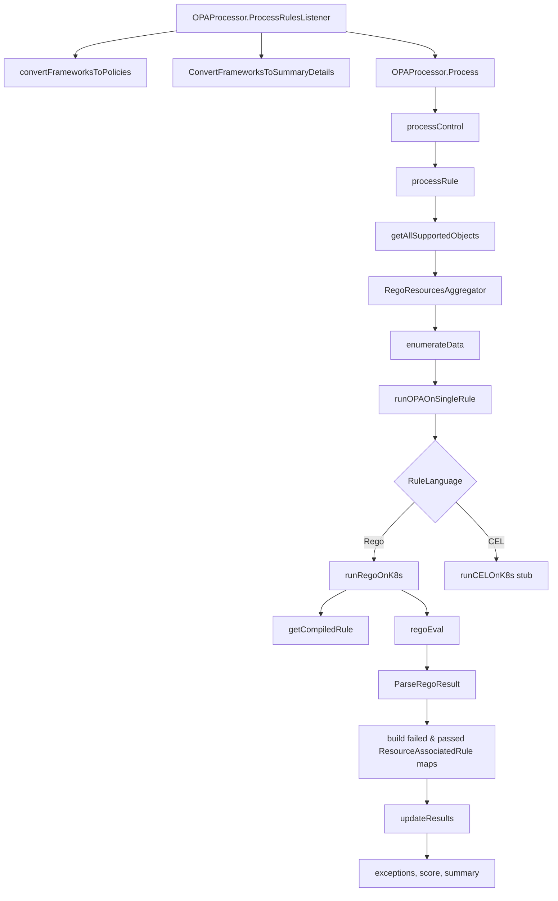

# OPA/Rego Evaluation Flow

This document traces the OPA/Rego rule-evaluation pipeline in `core/pkg/opaprocessor/`. It is intended as an onboarding guide for contributors who want to understand how Kubescape turns scanned Kubernetes objects into misconfiguration results.

## Key concepts

- **Framework** — a security benchmark (CIS, NSA-CISA, MITRE) that contains `Controls`.
- **Control** — a group of one or more `PolicyRule` objects plus metadata.
- **PolicyRule** — a single rule; for Rego this is a raw Rego module string plus matching metadata.
- **OPASessionObj** — the session state that holds resources, policies, report objects, and exception policies.
- **RegoDependenciesData** — the `data` and `input` values passed to every rule (cloud provider, control inputs).
- **RuleResponse** — the structured output produced by `reporthandling.ParseRegoResult` from an OPA `resultSet`.
- **ResourceAssociatedRule / ResourceAssociatedControl** — Kubescape's result structs after OPA results are merged.

## End-to-end flow

## Call-chain details

### `OPAProcessor` and `NewOPAProcessor`

`processorhandler.go` defines `OPAProcessor` and `NewOPAProcessor`. The struct holds the compiled-module cache (`compiledModules`), per-control timeout state (`ControlTimeout`, `TimedOutControls`), namespace filters, and the `OPASessionObj` that everything is recorded into.

### `ProcessRulesListener`

The public entry point in `processorhandler.go`:

1. Converts frameworks to `cautils.Policies` via `convertFrameworksToPolicies`.
2. Seeds report summary objects via `ConvertFrameworksToSummaryDetails`.
3. Calls `Process` to run the controls.
4. Builds scan coverage and reweights compliance scores after `Process` returns.
5. Calls `updateResults` to apply exceptions and finalize summaries.

### `Process`

The main control loop in `processorhandler.go`. For every `Control` in the policy set:

1. Checks for context cancellation.
2. Wraps evaluation in a `context.WithTimeout` when `ControlTimeout` is configured; if the deadline is exceeded, the control is marked via `markControlTimedOut` and recorded as not evaluated.
3. Calls `processControl` for the actual rule evaluation.
4. Merges the returned `resourcesAssociatedControl` map into `opap.ResourcesResult`.

### `processControl`

Iterates over the rules in a control and calls `processRule` for each. If a rule returns a non-empty `ResourceAssociatedRule` map, it builds a `ResourceAssociatedControl` and sets its status from the overall control definition.

### `processRule`

This is where per-rule, per-namespace work happens:

1. `getAllSupportedObjects` selects Kubernetes and external resources that match the rule's `Match` / `DynamicMatch` constraints.
2. `RegoResourcesAggregator` assembles the objects the rule will see as input.
3. `enumerateData` optionally narrows the list using a rule's `ResourceEnumerator` (a Rego snippet that filters the input set).
4. `runOPAOnSingleRule` dispatches to `runRegoOnK8s` or the CEL stub based on `rule.RuleLanguage`.
5. After Rego returns `RuleResponse` objects, the function performs a two-pass merge:
   - First, it pre-seeds `failedIDs` and creates `ResourceAssociatedRule` entries for failed resources.
   - Second, it marks every non-failed input resource as `StatusPassed`.
6. Finally, it attaches remediation paths and related objects to each failed `ResourceAssociatedRule`.

### `runRegoOnK8s` and `regoEval`

`runRegoOnK8s` in `processorhandler.go`:

1. Registers custom Rego builtins (`cosign.verify`, `cosign.has_signature`, `image.parse_normalized_name`) once via `sync.Once`.
2. Fetches rule source with `getRuleData`.
3. Compiles the rule through `getCompiledRule`, which caches the `*ast.Compiler` by rule name + source.
4. Builds an OPA `storage.Store` from `ruleRegoDependenciesData`.
5. Calls `regoEval` to run OPA with the compiled module, the store, and the K8s objects as `input`.
6. Parses the OPA `resultSet` into `[]reporthandling.RuleResponse`.

`regoEval` uses `rego.New` with a fixed query `data.armo_builtins`, `ast.RegoV0`, and `rego.Input(inputObj)`.

### `updateResults`

`processorhandlerutils.go`:

1. Removes sensitive fields from `AllResources` (`removeData`).
2. Applies exception policies to each `ResourcesResult` entry.
3. Emits exception match events.
4. Appends resource results to the summary.
5. Initializes the final summary resources map.

## Data transformations

### Kubernetes object → Rego `input`

1. `workloadinterface.IMetadata` objects are collected into `[]workloadinterface.IMetadata` per namespace.
2. `RegoResourcesAggregator` converts them to a list of `map[string]any` objects.
3. `workloadinterface.ListMetaToMap` produces the raw `[]map[string]any` slice.
4. `regoEval` passes this slice to OPA as `rego.Input(inputObj)`.

### OPA result → Kubescape result

1. OPA's `rego.Eval` returns a `rego.ResultSet`.
2. `reporthandling.ParseRegoResult` converts it to `[]reporthandling.RuleResponse`.
3. `processRule` maps each failed resource to a `*resourcesresults.ResourceAssociatedRule` with `StatusFailed`, paths, and related objects.
4. Resources that are not in the failed set are marked `StatusPassed`.
5. `processControl` wraps rule results in `resourcesresults.ResourceAssociatedControl`.
6. `updateResults` applies exceptions and pushes the final data into `opap.Report`.

## CEL and the future

`runOPAOnSingleRule` currently dispatches to `runCELOnK8s`, which is a stub that returns an error. The CEL evaluator under `core/pkg/opaprocessor/cel/` is intended to become the second rule language. The rest of `processorhandler.go` is already structured to treat `RuleResponse` as a language-agnostic result.

## Where to add tests

The package already has useful tests that exercise this flow:

- `processorhandler_test.go` — `TestProcessRule`, `TestProcessResourcesResult`
- `processorhandler_timeout_test.go` — `TestProcess_ControlTimeout`
- `processorhandler_clusterscope_test.go` — `TestProcessRule_ClusterScopedPathsAcrossNamespaces`

Good follow-up contributions include:

- Unit tests for `markResourcesSkipped` error paths.
- Unit tests for `getCompiledRule` cache behavior.
- A table-driven test for `regoEval` with a tiny inline Rego module.

## See also

- `core/pkg/policyhandler/` — where frameworks and controls are loaded before evaluation.
- `github.com/kubescape/regolibrary` — the actual Rego rules (not in this repo).
- `github.com/kubescape/opa-utils/reporthandling` — `PolicyRule`, `RuleResponse`, and `RegoResourcesAggregator`.
