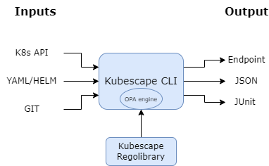
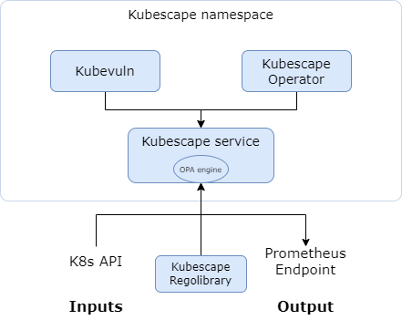

# Kubescape Architecture

This document describes the architecture of Kubescape, covering both the CLI tool and the in-cluster operator.

## Overview

Kubescape is designed as a modular security platform that can run in two primary modes:

1. **CLI Mode** - On-demand scanning from your local machine
2. **Operator Mode** - Continuous monitoring within your Kubernetes cluster

Both modes share core scanning logic but differ in how they collect data and report results.

---

## CLI Architecture

The Kubescape CLI is a standalone binary that performs security assessments on-demand.

<div align="center">
    
</div>

### Core Components

#### 1. Command Layer (`cmd/`)

The entry point for all CLI operations. Key commands include:

| Command | Description |
|---------|-------------|
| `scan` | Orchestrates misconfiguration and vulnerability scanning |
| `scan image` | Container image vulnerability scanning |
| `fix` | Auto-remediation of misconfigurations |
| `patch` | Container image patching |
| `list` | Lists available frameworks and controls |
| `download` | Downloads artifacts for offline use |
| `vap` | Validating Admission Policy management |
| `mcpserver` | MCP server for AI integration |
| `operator` | Communicates with in-cluster operator |

#### 2. Core Engine (`core/`)

The main scanning engine that:

- Loads and parses Kubernetes resources
- Evaluates resources against security controls
- Aggregates and formats results
- Manages scan lifecycle and configuration

#### 3. Policy Evaluation (OPA/Rego)

Kubescape uses [Open Policy Agent (OPA)](https://www.openpolicyagent.org/) as its policy engine:

```
┌─────────────────────────────────────────────────────────────┐
│                    Policy Evaluation Flow                    │
├─────────────────────────────────────────────────────────────┤
│                                                              │
│  K8s Resources ──► OPA Engine ──► Rego Policies ──► Results │
│       │                               │                      │
│       │                               ▼                      │
│       │                        Regolibrary                   │
│       │                    (Control Library)                 │
│       │                                                      │
│       ▼                                                      │
│  - YAML files                                                │
│  - Helm charts                                               │
│  - Live cluster                                              │
│  - Git repositories                                          │
│                                                              │
└─────────────────────────────────────────────────────────────┘
```

**[Regolibrary](https://github.com/kubescape/regolibrary)** contains:
- Security controls (200+)
- Framework definitions (NSA-CISA, MITRE ATT&CK®, CIS Benchmarks)
- Control metadata and remediation guidance

#### 4. Image Scanner (Grype Integration)

For vulnerability scanning, Kubescape integrates [Grype](https://github.com/anchore/grype):

```
┌─────────────────────────────────────────────────────────────┐
│                  Image Scanning Pipeline                     │
├─────────────────────────────────────────────────────────────┤
│                                                              │
│  Container Image ──► SBOM Generation ──► Vulnerability DB   │
│                            │                    │            │
│                            ▼                    ▼            │
│                      Syft Engine          Grype Matching     │
│                            │                    │            │
│                            └────────┬───────────┘            │
│                                     ▼                        │
│                              CVE Results                     │
│                                                              │
└─────────────────────────────────────────────────────────────┘
```

#### 5. Image Patcher (Copacetic Integration)

For patching vulnerable images, Kubescape uses [Copacetic](https://github.com/project-copacetic/copacetic):

```
┌─────────────────────────────────────────────────────────────┐
│                   Image Patching Pipeline                    │
├─────────────────────────────────────────────────────────────┤
│                                                              │
│  Vulnerable Image ──► Copa ──► BuildKit ──► Patched Image   │
│        │                          │                          │
│        ▼                          ▼                          │
│  - Scan for CVEs           - Apply OS patches               │
│  - Identify fixes          - Rebuild layers                 │
│  - Generate patch plan     - Push to registry               │
│                                                              │
└─────────────────────────────────────────────────────────────┘
```

### Data Flow (CLI Scan)

```
┌──────────────────────────────────────────────────────────────────────┐
│                         CLI Scan Data Flow                            │
├──────────────────────────────────────────────────────────────────────┤
│                                                                       │
│    Input Sources              Processing              Output          │
│    ─────────────              ──────────              ──────          │
│                                                                       │
│  ┌─────────────┐         ┌─────────────────┐    ┌─────────────────┐  │
│  │ Kubernetes  │────────►│                 │    │  Console        │  │
│  │ Cluster     │         │                 │───►│  (pretty-print) │  │
│  └─────────────┘         │                 │    └─────────────────┘  │
│                          │                 │                          │
│  ┌─────────────┐         │  Kubescape      │    ┌─────────────────┐  │
│  │ YAML Files  │────────►│  Core Engine    │───►│  JSON/SARIF     │  │
│  └─────────────┘         │                 │    └─────────────────┘  │
│                          │                 │                          │
│  ┌─────────────┐         │                 │    ┌─────────────────┐  │
│  │ Helm Charts │────────►│                 │───►│  HTML/PDF       │  │
│  └─────────────┘         │                 │    └─────────────────┘  │
│                          │                 │                          │
│  ┌─────────────┐         │                 │    ┌─────────────────┐  │
│  │ Git Repos   │────────►│                 │───►│  JUnit XML      │  │
│  └─────────────┘         └─────────────────┘    └─────────────────┘  │
│                                                                       │
└──────────────────────────────────────────────────────────────────────┘
```

---

## Operator Architecture (In-Cluster)

The Kubescape Operator provides continuous security monitoring within the cluster.

<div align="center">
    
</div>

### Components

#### 1. Kubescape Operator

The main controller that:
- Watches for changes to Kubernetes resources
- Triggers scans on schedule or on-demand
- Manages scan lifecycle
- Stores results in Custom Resources

#### 2. Kubevuln

Handles container image vulnerability scanning:
- Scans images running in the cluster
- Generates SBOMs (Software Bill of Materials)
- Matches against vulnerability databases
- Creates `VulnerabilityManifest` CRs

#### 3. Host Scanner

Collects security-relevant information from cluster nodes:
- Kernel parameters
- Kubelet configuration
- Container runtime settings
- File permissions

#### 4. Storage

Kubescape uses Custom Resources to store scan results:

| CRD | Description |
|-----|-------------|
| `VulnerabilityManifest` | Image vulnerability scan results |
| `VulnerabilityManifestSummary` | Aggregated vulnerability summaries |
| `WorkloadConfigurationScan` | Misconfiguration scan results |
| `WorkloadConfigurationScanSummary` | Aggregated configuration summaries |
| `ApplicationProfile` | Runtime behavior profiles |
| `NetworkNeighborhood` | Observed network connections |

#### 5. Node Agent (Runtime Security)

For runtime security, the Node Agent uses eBPF via [Inspektor Gadget](https://github.com/inspektor-gadget/inspektor-gadget):

```
┌─────────────────────────────────────────────────────────────┐
│                   Runtime Security Flow                      │
├─────────────────────────────────────────────────────────────┤
│                                                              │
│  Kernel ──► eBPF Probes ──► Node Agent ──► Kubescape        │
│    │                            │                            │
│    ▼                            ▼                            │
│  System calls              - Process exec                    │
│  Network events            - File access                     │
│  File operations           - Network connections             │
│                            - Anomaly detection               │
│                                                              │
└─────────────────────────────────────────────────────────────┘
```

### Data Flow (Operator)

```
┌──────────────────────────────────────────────────────────────────────┐
│                      Operator Data Flow                               │
├──────────────────────────────────────────────────────────────────────┤
│                                                                       │
│  ┌─────────────┐     ┌─────────────┐     ┌─────────────────────────┐ │
│  │ Kubernetes  │     │  Kubescape  │     │   Custom Resources      │ │
│  │ API Server  │────►│  Operator   │────►│   (Scan Results)        │ │
│  └─────────────┘     └─────────────┘     └─────────────────────────┘ │
│         │                   │                        │                │
│         │                   │                        ▼                │
│         │                   │            ┌─────────────────────────┐ │
│         │                   │            │  Prometheus Metrics     │ │
│         │                   │            └─────────────────────────┘ │
│         │                   │                        │                │
│         ▼                   ▼                        ▼                │
│  ┌─────────────┐     ┌─────────────┐     ┌─────────────────────────┐ │
│  │   Kubevuln  │     │ Node Agent  │     │  External Integrations  │ │
│  │   (Images)  │     │  (Runtime)  │     │  (ARMO Platform, etc.)  │ │
│  └─────────────┘     └─────────────┘     └─────────────────────────┘ │
│                                                                       │
└──────────────────────────────────────────────────────────────────────┘
```

---

## Frameworks and Controls

Kubescape evaluates resources against security frameworks:

### Supported Frameworks

| Framework | Description |
|-----------|-------------|
| **NSA-CISA** | Kubernetes Hardening Guidance |
| **MITRE ATT&CK®** | Threat-based security framework |
| **CIS Benchmarks** | Center for Internet Security best practices |
| **SOC2** | Service Organization Control 2 |
| **HIPAA** | Healthcare compliance requirements |
| **PCI-DSS** | Payment Card Industry standards |

### Control Structure

```yaml
Control:
  id: C-0005
  name: API server insecure port is enabled
  description: Check if the API server insecure port is enabled
  frameworks:
    - NSA
    - MITRE
  severity: High
  remediation: |
    Disable the insecure port by setting --insecure-port=0
  rules:
    - rego: |
        # OPA/Rego policy code
```

---

## Actors and actions

Who and what interacts with Kubescape, and what each one does. The interfaces they use are listed in [External interfaces](#external-interfaces).

| Actor | Through | Actions |
|-------|---------|---------|
| User (developer or cluster operator) | The CLI, the kubectl plugin or the CLI container image | Scans manifests, Helm charts, repositories, clusters and images; fixes manifests; patches images; manages configuration and offline artifacts |
| CI pipeline | The CLI, run non-interactively | The same as a user. Gates on the [exit code](cli-reference.md#exit-codes) and publishes reports such as SARIF or JUnit |
| AI assistant (MCP client) | `kubescape mcpserver` | Reads the vulnerability and configuration results the operator stores in the cluster, and runs scans through the server's tools |
| HTTP API client, usually the Kubescape Operator | The REST API of the microservice image | Starts and cancels scans, polls their status, and reads and deletes their results |
| Kubernetes API server | A kubeconfig, or the pod's service account for the microservice | Serves the resources a cluster scan reads. `kubescape operator` port-forwards through it to the operator |
| Container registries | Image references | Serve images for image scanning. `kubescape patch` pushes the patched image to a registry with `--push`, or loads it into the local Docker daemon |
| Policy source | HTTPS, or a local directory | Provides frameworks, controls, exceptions and control inputs: the [regolibrary](https://github.com/kubescape/regolibrary) GitHub releases by default, or local files given with `--use-from` or `--use-artifacts-from` |
| Vulnerability database | HTTPS | Provides the Grype database for image scanning. `--grype-db-url` sets another source |
| Git hosts | Git over HTTPS | Serve the repository when a scan target is a remote Git URL |
| Kubescape backend (optional) | HTTPS, only when an account ID or `--server` is configured | Provides policies, exceptions and control inputs in place of the regolibrary, and receives reports sent with `--submit` |
| Webhook receivers (optional) | HTTPS POST, only with `--notify` | Receive the scan summary: a Block Kit message for Slack, an Adaptive Card for Microsoft Teams, and the summary JSON for any other URL |
| Cloud provider APIs (EKS, GKE, AKS) | The cloud SDK's default credentials, during a scan of a managed cluster | Describe the cluster and its registries, for the controls that need that data |
| Version check service | HTTPS POST to `version-check.ks-services.co` on `scan`, `version` and `update`, unless `KS_SKIP_UPDATE_CHECK` is `true` | Receives the client version and build, the framework and scanning context, whether the run came from a pipeline, the account ID when one is configured, the Helm chart version when run from the chart, and for a cluster scan the node count and an ID derived from the cluster's `kubernetes` Service. Replies with the latest release |
| OpenTelemetry collector (optional) | OTLP, only with `--otel-endpoint` or `OTEL_EXPORTER_OTLP_ENDPOINT` | Receives the scan's traces and metrics |

## External interfaces

### Exposed

| Interface | Released in | Described in |
|-----------|-------------|--------------|
| Command line: commands, flags, environment variables and exit codes | CLI binaries, kubectl plugin, CLI image | [CLI reference](cli-reference.md), including [environment variables](cli-reference.md#environment-variables) and [exit codes](cli-reference.md#exit-codes) |
| Scan reports, written to stdout or a file in the formats `--format` accepts | CLI binaries, kubectl plugin, CLI image | [CLI reference: `kubescape scan`](cli-reference.md#kubescape-scan) |
| Local configuration and cache in `~/.kubescape`, or `KS_CACHE_DIR` | CLI binaries, kubectl plugin, CLI image | [CLI reference: `kubescape config`](cli-reference.md#kubescape-config) |
| MCP server, over stdio by default or over SSE on `127.0.0.1` with `--transport sse` | CLI binaries, kubectl plugin, CLI image | [MCP server](mcp-server.md) |
| REST API on port 8080 (`KS_PORT`): `/v1/scan`, `/v1/status`, `/v1/results` and the deprecated `/v1/metrics`, the `/livez` and `/readyz` probes, and the OpenAPI document at `/openapi/v2/`. When `KS_API_TOKEN` is set, `/v1/*` requires it as a bearer token | Microservice image | [HTTP handler](../httphandler/README.md), [OpenAPI document](../httphandler/docs/swagger.yaml) |
| pprof debug server, off unless `KS_PPROF_ENABLED` is `true`, bound to `127.0.0.1:6060` unless `KS_PPROF_ADDR` says otherwise | Microservice image | [HTTP handler: environment variables](../httphandler/README.md#environment-variables) |

### Consumed

The outbound connections in [Actors and actions](#actors-and-actions). A scan of a cluster, an image or a remote repository reaches the Kubernetes API server, the registry or the Git host it targets. It also fetches its policies and, for image scanning, the vulnerability database, unless they are given locally (`--use-artifacts-from`, `--use-from`, `--grype-db-url`). The version check runs unless `KS_SKIP_UPDATE_CHECK` is set, and cloud provider APIs are called only for a managed cluster. The Kubescape backend, webhook receivers and an OpenTelemetry collector are contacted only when configured.

---

## Security Model

### CLI Mode

- Runs with the permissions of the executing user
- Uses kubeconfig for cluster access
- No persistent state in the cluster
- Results stored locally or sent to configured backend

### Operator Mode

- Runs as a Kubernetes workload
- Uses ServiceAccount with defined RBAC
- Stores results as Custom Resources
- Can send data to external backends (optional)

### Network Requirements

| Component | Outbound Connections |
|-----------|---------------------|
| CLI | Vulnerability DB updates, framework downloads |
| Operator | Vulnerability DB updates, optional backend |
| Offline | All artifacts can be pre-downloaded |

---

## Extensibility

### Custom Controls

You can create custom controls using Rego:

```rego
package armo_builtins
import rego.v1

deny contains msga if {
    # Your custom policy logic
    input.kind == "Deployment"
    not input.spec.template.spec.securityContext.runAsNonRoot
    
    msga := {
        "alertMessage": "Deployment should run as non-root",
        "alertScore": 7,
        "failedPaths": ["spec.template.spec.securityContext.runAsNonRoot"],
        "fixPaths": [{"path": "spec.template.spec.securityContext.runAsNonRoot", "value": "true"}]
    }
}
```

### Integration Points

- **HTTP API** - For programmatic access ([see httphandler docs](../httphandler/README.md))
- **MCP Server** - For AI assistant integration ([see mcp-server docs](mcp-server.md))
- **Prometheus Metrics** - For monitoring and alerting
- **Webhook** - For external notifications

---

## Further Reading

- [Getting Started Guide](getting-started.md)
- [Installation Guide](installation.md)
- [Regolibrary (Controls)](https://github.com/kubescape/regolibrary)
- [Helm Charts](https://github.com/kubescape/helm-charts)
- [ARMO Platform Integration](providers.md)