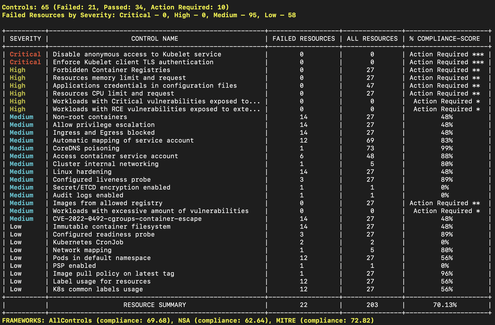

# Getting started with Kubescape

Kubescape can run as a command line tool on a client, as an operator inside a cluster, as part of your CI/CD process, or more.  

The best way to get started with Kubescape is to download it to the machine you use to manage your Kubernetes cluster.

## Install Kubescape
(We're a security product; please read the file before you run it!)
* [Install on Linux / macOS (X86_64 or ARM64 (M1/M2))](https://github.com/kubescape/kubescape/wiki/Installation#x86_64-or-arm64-m1m2-linux--macos)
* [Install on Windows (X86_64)](https://github.com/kubescape/kubescape/wiki/Installation#x86_64-windows)
* [Install on openSUSE](https://github.com/kubescape/kubescape/wiki/Installation#opensuse)
* [Install on Arch Linux](https://github.com/kubescape/kubescape/wiki/Installation#arch)
* [Install on Ubuntu](https://github.com/kubescape/kubescape/wiki/Installation#ubuntu)
* [Install on Other Debian-based or RPM-based Linux Distros](https://software.opensuse.org/download.html?project=home%3Akubescape&package=kubescape)
* [Install on NixOS or Linux/macOS via nix](https://github.com/kubescape/kubescape/wiki/Installation#nixos-or-with-nix) 
* [Install with Homebrew](https://github.com/kubescape/kubescape/wiki/Installation#homebrew)
* [Install with Chocolatey](https://github.com/kubescape/kubescape/wiki/Installation#chocolatey)
* [Install with Scoop](https://scoop.sh/#/apps?q=kubescape&s=0&d=1&o=true&id=1f5ae05eaafe3e7a26505f0889101e0da91ffe91)
* [Install with Krew](https://github.com/kubescape/kubescape/wiki/Installation#krew)
* [Install with Snap](https://snapcraft.io/cli-kubescape)

## Run your first scan

```sh
kubescape scan --enable-host-scan --verbose
```

You will see output like this:



## Usage

_Some documentation on using Kubescape is yet to move here from the [ARMO Platform docs](https://hub.armosec.io/docs?utm_source=github&utm_medium=repository)_.

### Examples

* Scan a running Kubernetes cluster:

    ```sh
    kubescape scan --enable-host-scan  --verbose
    ```

    > **Note**  
    > [Read more about host scanning](https://hub.armosec.io/docs/host-sensor?utm_source=github&utm_medium=repository).

* Scan a running Kubernetes cluster with the [NSA framework](https://www.nsa.gov/Press-Room/News-Highlights/Article/Article/2716980/nsa-cisa-release-kubernetes-hardening-guidance/):

    ```sh
    kubescape scan framework nsa
    ```

* Scan a running Kubernetes cluster with the [MITRE ATT&CK® framework](https://www.microsoft.com/security/blog/2021/03/23/secure-containerized-environments-with-updated-threat-matrix-for-kubernetes/):

    ```sh
    kubescape scan framework mitre
    ```

* Scan for a specific control, using the control name or control ID. [See the list of controls](https://hub.armosec.io/docs/controls?utm_source=github&utm_medium=repository).

    ```sh
    kubescape scan control "Privileged container"
    ```

* Use an alternative kubeconfig file:

    ```sh
    kubescape scan --kubeconfig cluster.conf
    ```

* Scan specific namespaces:

    ```sh
    kubescape scan --include-namespaces development,staging,production
    ```

* Exclude certain namespaces:

    ```sh
    kubescape scan --exclude-namespaces kube-system,kube-public
    ```

* Scan local YAML/JSON files before deploying:
    ```sh
    kubescape scan *.yaml
    ```

    Take a look at the demonstration](https://youtu.be/Ox6DaR7_4ZI).

* Scan Kubernetes manifest files from a Git repository:

    ```sh
    kubescape scan https://github.com/kubescape/kubescape
    ```

* Scan with exceptions

    ```sh
    kubescape scan --exceptions examples/exceptions/exclude-kube-namespaces.json
    ```

    Objects with exceptions will be presented as `exclude` and not `fail`.

    [See more examples about exceptions.](/examples/exceptions/README.md)

* Scan Helm charts 

    ```sh
    kubescape scan </path/to/directory>
    ```

    > **Note**  
    > Kubescape will load the default VALUES file.

* Scan a Kustomize directory 

    ```sh
    kubescape scan </path/to/directory>
    ```

    > **Note**  
    > Kubescape will generate Kubernetes YAML objects using a `kustomize` file and scan them for security.

### Output formats

* JSON:

    ```sh
    kubescape scan --format json --format-version v2 --output results.json
    ```

    > **Note**  
    > Add the `--format-version v2` flag for maximum compatibility.

* junit XML: 

    ```sh
    kubescape scan --format junit --output results.xml
    ```

* PDF:

    ```sh
    kubescape scan --format pdf --output results.pdf
    ```

    _Contributed by [@alegrey91](https://github.com/alegrey91)_

* Prometheus metrics:

    ```
    kubescape scan --format prometheus
    ```

    _Contributed by [@Joibel](https://github.com/Joibel)_

* HTML

    ```
    kubescape scan --format html --output results.html
    ```

* Display all scanned resources (including the resources which passed):

    ```sh
    kubescape scan --verbose
    ```

## Offline/air-gapped environment support

It is possible to run Kubescape offline!  Check out our [video tutorial](https://youtu.be/IGXL9s37smM).

### Download all artifacts

1. Download the controls and save them in the local directory.  If no path is specified, they will be saved in `~/.kubescape`.

   ```sh
   kubescape download artifacts --output path/to/local/dir
   ```

2. Copy the downloaded artifacts to the offline system.

3. Scan using the downloaded artifacts:

   ```sh
   kubescape scan --use-artifacts-from path/to/local/dir
   ```

### Download a single artifact

You can also download a single artifact, and scan with the `--use-from` flag:

1. Download and save in a file. If no file name is specified, the artifact will be saved as `~/.kubescape/<framework name>.json`.

    ```sh
    kubescape download framework nsa --output /path/nsa.json
    ```

2. Copy the downloaded artifacts to the offline system.

3. Scan using the downloaded framework:

    ```sh
    kubescape scan framework nsa --use-from /path/nsa.json
    ```

## Other ways to use Kubescape

### Scan periodically using Helm 

We publish [a Helm chart](https://github.com/kubescape/helm-charts) for our in-cluster components. [Please follow the instructions here](https://hub.armosec.io/docs/installation-of-armo-in-cluster?utm_source=github&utm_medium=repository)

### VS Code Extension 

 

Scan your YAML files while writing them using our [VS Code extension](https://github.com/armosec/vscode-kubescape/blob/master/README.md).

### Lens Extension

View Kubescape scan results directly in the [Lens IDE](https://k8slens.dev/) using the [Kubescape Lens extension](https://github.com/armosec/lens-kubescape/blob/master/README.md).

## Playground

Experiment with Kubescape in the [Kubescape playground](https://killercoda.com/saiyampathak/scenario/kubescape): this scenario will install a K3s cluster and Kubescape.  You can start with any of the `kubescape scan` commands in the [examples](#examples).

## Tutorial videos

* [Kubescape overview](https://youtu.be/wdBkt_0Qhbg)
* [How to secure Kubernetes clusters with Kubescape](https://youtu.be/ZATGiDIDBQk)
* [Scan Kubernetes YAML files](https://youtu.be/Ox6DaR7_4ZI)
* [Scan container image registry](https://youtu.be/iQ_k8EnK-3s)
* [Scan Kubescape on an air-gapped environment (offline support)](https://youtu.be/IGXL9s37smM)
* [Managing exceptions in ARMO Platform](https://youtu.be/OzpvxGmCR80)
* [Configure and run customized frameworks](https://youtu.be/12Sanq_rEhs)
* Customize control configurations: 
  - [Kubescape CLI](https://youtu.be/955psg6TVu4) 
  - [ARMO Platform](https://youtu.be/lIMVSVhH33o)
