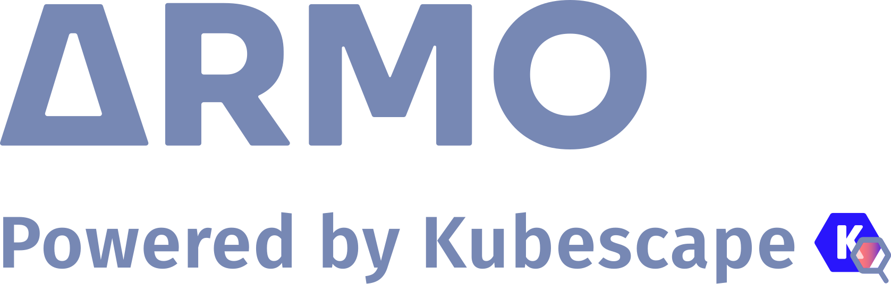
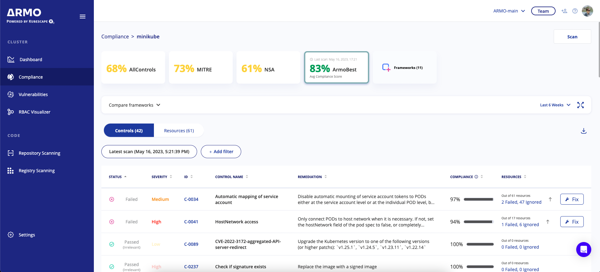
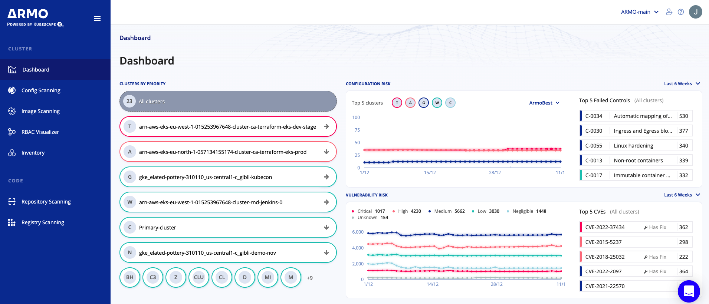

[ARMO Platform](https://cloud.armosec.io/account/sign-up?utm_source=ARMOgithub&utm_medium=ARMOcli) is an enterprise solution based on Kubescape. It’s a multi-cloud and multi-cluster Kubernetes and CI/CD security platform behind a single pane of glass. ARMO Platform includes Kubernetes hardening and compliance assistance, misconfiguration scanning and remediation, prioritized container image vulnerability reporting, an RBAC investigator and more.

Using ARMO Platform, you will save valuable time and make spot-on hardening decisions with contextual insights, based on the data from your scans and environment.

## Connect Kubescape to ARMO Platform

1. Install Kubescape
    ```
    curl -s https://raw.githubusercontent.com/kubescape/kubescape/master/docs/providers/install.sh | /bin/bash
    ```
    > Alternatively, you can [install Kubescape using package managers](../installation.md#installation)

2. Scan Kubescape with the `--server` flag
    ```
    kubescape scan --server api.armosec.io
    ```

The scan results will be submitted to the ARMO Platform.

3. Using the link printed at the end of the scan, sign up for the ARMO Platform — for free — and see your scan results.



## Key features: 

💪 DevSecOps Dashboard: A single pane of glass for different security and DevOps stakeholders, providing each with the information they need, within the required context, and creating a common language between them.

💪 Enterprise Support: Additional support options including escalation options, response SLA, and a dedicated account manager.

💪 Premium Plugins: Plugins for collaboration tools such as Slack and Jira to enhance collaboration capabilities and provide more context to workflows.

💪 Multi-user and Multi-tenancy: Support for multiple users to access the same account and separate departments in an enterprise to use the same instance of ARMO Platform.

💪 Authentication & Security: Third-party authentication SSO using SAML or OIDC and user access and permission management.

💪 Data retention: Data retention capabilities to meet compliance and regulation policies.

💪 RBAC visualizer: an interactive tool for easy monitoring of Kubernetes access permissions.



