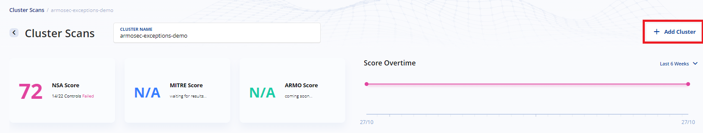
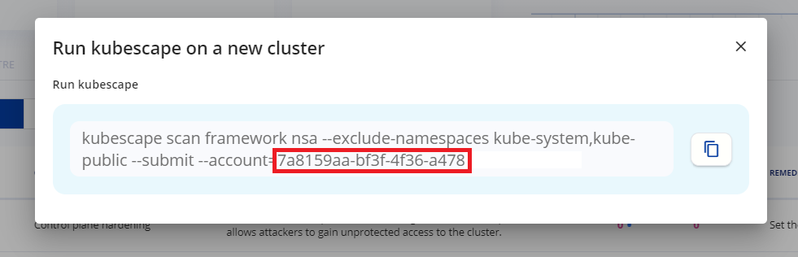

# Repeatedly Kubescape Scanning

You can scan your cluster repeatedly by adding a `CronJob` that will repeatedly trigger kubescape

* Setup [scanning & submitting](#scanning-&-submitting)
* Setup [scanning without submitting](#scanning-without-submitting)

## Scanning & Submitting

If you wish to repeatedly scan and submit the result to the [Kubescape SaaS version](https://portal.armo.cloud/) where you can benefit the features the SaaS version provides, please follow this instructions ->

1. Apply kubescape namespace
    ```
    kubectl apply ks-namespace.yaml
    ```

2. Apply serviceAccount and roles
    ```
    kubectl apply ks-serviceAccount.yaml
    ```

3. Setup and apply configMap
   
    Before you apply the configMap you need to set the account ID and cluster name in the `ks-configMap.yaml` file.

    * Set cluster name:
        Run `kubectl config current-context` and set the result in the `data.clusterName` field
    * Set account ID:
        1. Navigate to the [Kubescape SaaS version](https://portal.armo.cloud/) and login/sign up for free 
        2. Click the `Add Cluster` button on the top right of the page 
            
        3. Copy the value of `--account` and set it in the `data.customerGUID` field
            

        Make sure the configMap looks as following;
        ```
        kind: ConfigMap 
        apiVersion: v1 
        metadata:
        name: kubescape 
        labels:
            app: kubescape
        namespace: kubescape
        data:
        config.json: |
            {
                "customerGUID": "XXXXXXXX-XXXX-XXXX-XXXXXXXXXXXX",
                "clusterName": "my-awesome-cluster-name"
            }
        ```

    Finally, apply the configMap
    ```
    kubectl apply ks-configMap.yaml
    ```

4. Apply CronJob

    Before you apply the cronJob, make sure the scanning frequency suites your needs
    ```
    kubectl apply ks-cronJob-submit.yaml
    ```

## Scanning Without Submitting

If you wish to repeatedly scan but not submit the scan results, follow this instructions ->

1. Apply kubescape namespace
    ```
    kubectl apply ks-namespace.yaml
    ```

2. Apply serviceAccount and roles
    ```
    kubectl apply ks-serviceAccount.yaml
    ```

3. Apply CronJob

    Before you apply the cronJob, make sure the scanning frequency suites your needs
    ```
    kubectl apply ks-cronJob-non-submit.yaml
    ```